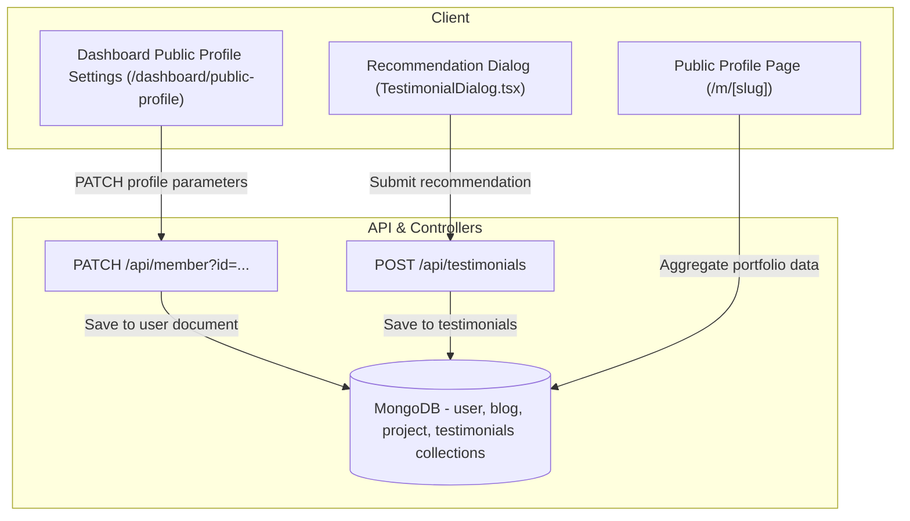

# Public Member Profiles Architecture & Implementation

This document provides a comprehensive reference for the completed Public Member Profiles and recommendations system in the BUCC Web Portal. It details the database structures, security validations, rendering strategies, and visual requirements implemented to showcase BUCC talent.

---

## 1. Architectural Dataflow

The profile configuration and viewing architecture coordinates dashboard updates, public listings, and recommendations.



---

## 2. Database Schema Reference

All data structures are defined using Mongoose schemas.

### 2.1 Unified `User` Schema Extensions
- **File:** [src/model/User.ts](file:///C:/Users/Abir/Desktop/bucc-main/src/model/User.ts)
- **Key Profile Fields:**
  - `profileSlug`: Unique, lowercase string claimed by the user. Formatted and trimmed automatically.
  - `isPublicProfile`: Boolean control to activate/deactivate the public page.
  - `bio`: Text biography.
  - `cvLink`: URL string pointing to an external Google Drive/Dropbox PDF.
  - `coverImage`: URL for the top page banner asset.
  - `experience`: Markdown string describing employment history.
  - `education`: Markdown string describing academic background.
  - `achievements`: Markdown string describing awards.
  - `certifications`: Markdown string describing professional certifications.
  - `recentActivity`: Monospace-accented list entries separated by newlines.
- **Privacy & Visibility Toggles:**
  - `showPersonalEmail`, `showPhoneNumber`, `showProjects`, `showBlogs`, `showTestimonials`, `showExperience`, `showEducation`, `showAchievements`, `showCertifications`, `showRecentActivity`, `showGithubStats`.

### 2.2 `Testimonial` Schema
- **File:** [src/model/Testimonial.ts](file:///C:/Users/Abir/Desktop/bucc-main/src/model/Testimonial.ts)
- Represents peer recommendations authored by senior members (EB) or club Alumni.
- **Fields:**
  - `author`: Reference ObjectId matching a [User](file:///C:/Users/Abir/Desktop/bucc-main/src/model/User.ts) document.
  - `targetMember`: Reference ObjectId of the profile recipient.
  - `relationship`: Descriptive context (e.g., "General Secretary", "Director of HR").
  - `content`: Narrative recommendation body text.
  - `isApproved`: Boolean flag. Defaults to `true` (auto-moderated).

---

## 3. Auth Mapping & API Handlers

### 3.1 Better Auth Fields
- **File:** [src/lib/auth.ts](file:///C:/Users/Abir/Desktop/bucc-main/src/lib/auth.ts)
- All new database fields are mapped inside Better Auth's `user.additionalFields` config to ensure session integrity and correct type-casting on client sessions.

### 3.2 Member Profile API Handler (`/api/member`)
- **File:** [src/app/api/member/route.ts](file:///C:/Users/Abir/Desktop/bucc-main/src/app/api/member/route.ts)
- **GET:** Returns a user profile. Restricted to Governing Body (GB) and HR managers.
- **DELETE:** Deletes user record. Restricted to Governing Body (GB) and HR Department Heads.
- **PATCH:** Sanitizes and writes updates to profile fields:
  - **Self-Update Protection:** Users can modify their own record (`currentUser.id === memberID`).
  - **Payload Sanitization:** If a non-admin performs a self-update, administrative fields (`name`, `studentId`, `buccDepartment`, `bracuDepartment`, `designation`, `memberStatus`, `joinedBracu`, `joinedBucc`, `lastPromotion`) are stripped.
  - **Profile Slug Rules:**
    1. Validation: Checked against `/^[a-zA-Z0-9-]+$/` (alphanumeric and hyphens only).
    2. Reservation List: Blacklists system routes (e.g., `api`, `dashboard`, `login`, `about`, `people`, `m`).
    3. Uniqueness Check: Checks database to ensure the lowercase slug is not claimed.

### 3.3 Recommendations API Handler (`/api/testimonials`)
- **File:** [src/app/api/testimonials/route.ts](file:///C:/Users/Abir/Desktop/bucc-main/src/app/api/testimonials/route.ts)
- **POST:** Creates a recommendation. Authenticated user must have an Executive Body (EB) designation or be marked as Alumni.
- **DELETE:** Removes a recommendation. Author can delete their own recommendation; GB admins can delete any.

---

## 4. UI/UX Layout Patterns

The public profile layout ([src/app/(main)/m/[slug]/page.tsx](file:///C:/Users/Abir/Desktop/bucc-main/src/app/(main)/m/[slug]/page.tsx)) operates under strict visual constraints:

### 4.1 Contrast Overlays & Headings
Cover images feature a gradient fade (`bg-gradient-to-t from-black/60 via-black/20 to-transparent`) and heading text dropshadows (`drop-shadow-[0_2px_4px_rgba(0,0,0,0.6)]`) for maximum legibility in light and dark modes.

### 4.2 Monospace Metadata Sidebar
Renders official data (official G-Suite email, phone number, and join dates) using monochrome styling and structured monospace fonts (`font-mono text-xs`).

> [!NOTE]
> **Email Visibility Rule:** The page displays the official G-Suite email as a fallback, overriding it with the personal email only if the personal email is present and `showPersonalEmail` is toggled on in settings.

### 4.3 RSC Serialization Safeguards (Expandable Lists)
- **File:** [src/components/ExpandableSection.tsx](file:///C:/Users/Abir/Desktop/bucc-main/src/components/ExpandableSection.tsx)
- React Server Components (RSC) cannot serialize functional handlers (like map rendering callbacks) passed as props from server components to client modules.
- **Solution:** Switched `<ExpandableList>` to children composition using client-side `React.Children.toArray(children)` slicing:
  ```tsx
  import React, { useState } from "react";

  export function ExpandableList({ children, limit = 3 }) {
    const [expanded, setExpanded] = useState(false);
    const items = React.Children.toArray(children);
    const visibleItems = expanded ? items : items.slice(0, limit);

    return (
      <div>
        <ul>{visibleItems}</ul>
        {items.length > limit && (
          <button onClick={() => setExpanded(!expanded)}>Toggle</button>
        )}
      </div>
    );
  }
  ```

### 4.4 Live GitHub Coding Activity Chart
- Embeds a contribution chart dynamically utilizing the `ghchart.rshah.org` SVG endpoint targeting user-specified Github handles.
- Uses `dark:invert` filters to match the SVG lines with dark mode settings.

---

## 5. Verification Checklist
- Run `npm run build` locally to confirm dynamic routes validate compile constraints.
- Verify that standard users cannot POST to administrative endpoints or self-update designation statuses.
- Ensure that mobile drawers function responsively without blocking navigation links.
